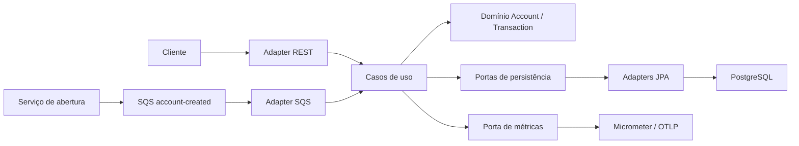
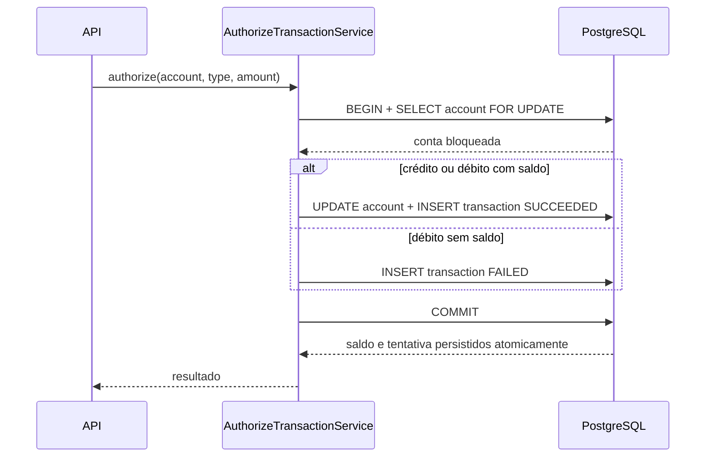
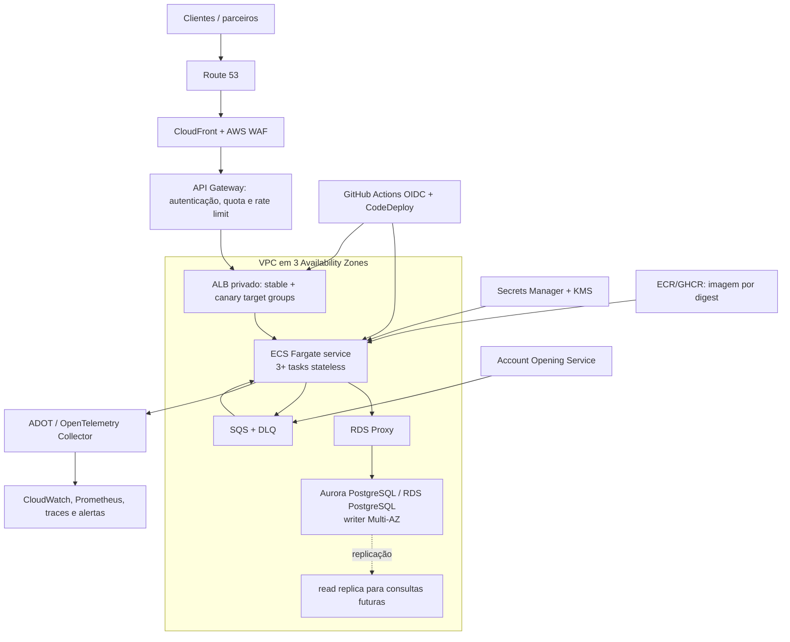

# Arquitetura e decisões técnicas

## Contexto

O serviço recebe eventos de contas abertas e autoriza transações síncronas. O caminho de escrita precisa preservar saldo não negativo e registrar todas as tentativas, inclusive débitos recusados. A escala ocorre principalmente entre contas diferentes; operações concorrentes na mesma conta precisam ser serializadas.

## Arquitetura lógica

O domínio não depende de HTTP, SQS, JPA ou Micrometer. Casos de uso dependem de portas; adapters implementam REST, mensageria, persistência e métricas. Essa separação permite testar regras financeiras sem infraestrutura e trocar tecnologias nas bordas.

## Consistência da autorização

O lock pessimista é por conta. Contas diferentes progridem em paralelo; uma conta muito quente é serializada, comportamento necessário para consistência, mas que limita seu throughput individual.

## Topologia proposta em AWS

### Dimensionamento e disponibilidade

- tarefas Fargate distribuídas em pelo menos três AZs, mínimo de três réplicas;
- autoscaling por CPU, memória, requisições por target, latência e backlog/idade do SQS;
- RDS/Aurora PostgreSQL Multi-AZ com backups, point-in-time recovery e failover testado;
- RDS Proxy para absorver churn de conexões durante autoscaling, respeitando o limite do writer;
- API Gateway/WAF para autenticação, quotas, rate limiting e proteção de borda;
- aplicação stateless; nenhuma afinidade de sessão é necessária;
- deploy por digest com canary e rollback automático.

Não há número honesto de réplicas ou pool sem SLO, pico de TPS, distribuição por conta e teste de carga. O cálculo deve partir da latência medida e aplicar Little's Law, mantendo margem para falha de uma AZ.

## Registro de decisões

| Decisão | Motivador | Tradeoffs e evolução |
|---|---|---|
| DDD + arquitetura hexagonal | isolar regras financeiras e facilitar testes | mais interfaces e mapeamentos; compensa em domínio crítico |
| PostgreSQL relacional | transação ACID atômica entre saldo e histórico, constraints e locks | writer é limite de escala; particionar transações e, em escala extrema, shard por `account_id` |
| Lock pessimista por conta | impedir lost update e saldo negativo sob concorrência | serializa contas quentes e pode aumentar espera; usar timeout, medir lock wait e evitar retry cego |
| `NUMERIC(19,2)`/`BigDecimal` | precisão determinística para dinheiro | suporta apenas escala 2; moedas com outra escala exigem value object por moeda ou minor units |
| REST síncrono para autorização | cliente precisa de resposta imediata | acopla disponibilidade ao writer; timeouts curtos, backpressure e idempotência são obrigatórios |
| SQS para abertura de contas | desacoplamento, buffering e escala independente | entrega at-least-once; consumidor é idempotente por `ON CONFLICT`, com DLQ para poison messages |
| Consistência forte no saldo | uma autorização não pode observar saldo obsoleto | cache e réplica não entram no write path; leituras analíticas podem usar réplicas |
| Transação como registro append-only | trilha operacional e financeira das tentativas | retenção cresce continuamente; particionamento temporal e política de arquivamento serão necessários |
| UUID atual | IDs globais sem coordenação | UUID aleatório fragmenta índices; avaliar UUIDv7 para novas transações mantendo UUID externo de contas |
| ECS Fargate + ALB + CodeDeploy | operação gerenciada, isolamento por task e canary nativo | custo maior que compute reservado; EKS só se houver necessidade organizacional de Kubernetes |
| OpenTelemetry + Micrometer | correlação vendor-neutral de logs, métricas e traces | custo/cardinalidade; nunca usar account/transaction ID como tag de métrica |
| Sem circuit breaker no PostgreSQL | circuit breaker não torna uma transação de saldo segura e pode amplificar inconsistência | usar pool limitado, timeout e fail-fast; CB aplica-se a futuras dependências HTTP não transacionais |

## Modelos de resiliência

### SQS

O consumidor confirma somente após sucesso. Exceções provocam redelivery; após cinco recebimentos a mensagem vai para a DLQ. O produtor pode repetir falhas transitórias com exponential backoff e **full jitter**, porque o evento possui identidade estável e o consumidor é idempotente. Erros de schema ou regra não devem ser repetidos indefinidamente.

### API e banco

Retries automáticos de autorização são perigosos sem idempotência: um timeout após commit pode fazer o cliente repetir um crédito. Até existir `Idempotency-Key` persistido com a resposta, a plataforma não deve repetir `POST` automaticamente. Timeout, pool limitado e load shedding são preferíveis a filas internas ilimitadas.

Deadlock/serialization failure pode ser repetido somente após a idempotência, com poucas tentativas, exponential backoff e full jitter. Nunca repetir erros de constraint, validação, saldo insuficiente ou indisponibilidade prolongada.

### Dependências HTTP futuras

Aplicar timeout por fase, circuit breaker, bulkhead e retry apenas em operações comprovadamente idempotentes. A ordem recomendada é timeout → bulkhead → circuit breaker → retry limitado com full jitter, sempre com orçamento total menor que o timeout do chamador.
