# Proposta de pipeline com Canary Release

## Objetivo

Reduzir o raio de impacto de defeitos em produção promovendo exatamente a mesma imagem validada em todos os ambientes e liberando a nova versão primeiro para uma parcela pequena do tráfego. A proposta adota AWS ECS/Fargate, Application Load Balancer e AWS CodeDeploy, por serem compatíveis com a infraestrutura AWS já utilizada pelo serviço.

A publicação da imagem e o deploy são processos diferentes: publicar cria um artefato imutável; fazer deploy altera tráfego de clientes. Apenas o segundo exige aprovação do ambiente `production`.

## Fluxo proposto

```mermaid
flowchart LR
    PR["Pull request"] --> CI["Testes, JaCoCo e SonarQube"]
    PR --> SEC["Dependency Review e CodeQL"]
    CI --> MERGE["Merge em main"]
    SEC --> MERGE
    MERGE --> IMG["Build único, SBOM, scan e imagem por digest"]
    IMG --> STG["Deploy em staging"]
    STG --> SMOKE["Smoke, contrato e integração"]
    SMOKE --> APPROVAL["Aprovação do environment production"]
    APPROVAL --> CANARY["Canary: 10% por 10 minutos"]
    CANARY -->|"SLOs saudáveis"| FULL["Promoção para 100%"]
    CANARY -->|"Alarme ou teste falhou"| ROLLBACK["Rollback automático para a versão estável"]
    FULL --> BAKE["Bake time e observação por 20 minutos"]
    BAKE -->|"Saudável"| DONE["Deploy concluído"]
    BAKE -->|"Regressão"| ROLLBACK
```

## Estágios da pipeline

### 1. Pull request

Bloqueios obrigatórios antes do merge:

- testes unitários, integração e E2E com Testcontainers;
- Quality Gate do SonarQube, incluindo cobertura de código novo;
- Dependency Review para vulnerabilidades altas e críticas;
- CodeQL para análise estática de segurança;
- validação de migrations e do contrato OpenAPI quando esses artefatos mudarem.

### 2. Build e publicação

Após o merge em `main`, a pipeline deve:

1. construir a imagem uma única vez;
2. identificá-la pelo digest e pelo SHA completo do commit;
3. gerar SBOM e executar scan da imagem;
4. gerar attestação de proveniência;
5. nunca reconstruir a imagem durante as promoções.

O deploy deve receber o digest, por exemplo `ghcr.io/org/repository@sha256:...`, e não `latest`. Isso garante que staging, canary e produção executem os mesmos bytes.

### 3. Staging

O ambiente de staging deve ter a mesma topologia de produção e executar:

- readiness e liveness checks;
- smoke tests da API;
- autorização sintética de crédito, débito aprovado e débito recusado;
- validação de persistência, SQS e telemetria;
- verificação de que uma recusa por saldo insuficiente não altera o saldo.

Os testes sintéticos devem usar uma conta técnica isolada e idempotência, sem misturar dados de clientes.

### 4. Aprovação de produção

O job de produção usa o GitHub Environment `production`, com revisores obrigatórios. A autenticação na AWS deve usar GitHub OIDC e uma role de deploy com privilégio mínimo, evitando access keys permanentes.

O workflow de produção deve ter concorrência exclusiva e `cancel-in-progress: false`. Um novo commit pode aguardar, mas nunca interromper um deploy em andamento no meio da troca de tráfego.

### 5. Canary Release

O CodeDeploy mantém dois task sets ECS atrás de target groups distintos:

- **stable**: versão atualmente aprovada;
- **canary**: nova imagem candidata.

A primeira etapa envia 10% do tráfego para a versão canary durante 10 minutos. Se os testes e alarmes permanecerem saudáveis, os 90% restantes são promovidos. Após atingir 100%, a pipeline observa a versão por mais 20 minutos antes de considerar o deploy concluído.

Uma progressão com mais etapas, como 5% → 25% → 50% → 100%, exige um controlador de entrega progressiva ou automação adicional de pesos no ALB. Para o primeiro ciclo, 10% → 100% reduz complexidade operacional e já limita materialmente o raio inicial de impacto.

## Quality gates de runtime

Os gates precisam comparar canary e stable, evitando decisões baseadas apenas em valores absolutos. A promoção deve parar quando qualquer condição crítica ocorrer:

| Sinal | Critério inicial sugerido | Ação |
|---|---:|---|
| HTTP 5xx | > 1% por 5 minutos ou 2x a stable | rollback |
| Latência p95 | > 750 ms ou 1,5x a stable | rollback |
| Tasks não saudáveis | >= 1 task canary reiniciando ou unhealthy | rollback |
| Erros de banco/SQS | acima do baseline por 5 minutos | rollback |
| Smoke transacional | qualquer cenário obrigatório falhar | rollback |
| Ausência de telemetria | sem métricas/traces da canary | interromper promoção |

`DEBIT` recusado por saldo insuficiente é resultado de negócio esperado e não deve ser contado como erro técnico. A métrica deve separar `transaction.status=FAILED` por motivo de negócio de exceções, timeouts e falhas de infraestrutura.

Os limites devem ser recalibrados com o baseline real. Volumes baixos precisam de quantidade mínima de requisições antes da decisão; sem amostra suficiente, a promoção deve aguardar ou exigir aprovação manual.

## Rollback

O rollback automático deve ser acionado por alarmes compostos do CloudWatch e por falha nos hooks de validação do CodeDeploy. Ele deve:

1. devolver 100% do tráfego ao task set stable;
2. manter o digest anterior registrado como versão conhecida e saudável;
3. preservar logs, traces, métricas e eventos do deployment para investigação;
4. marcar o deployment como falho no GitHub e no CodeDeploy;
5. impedir nova promoção do mesmo digest.

Rollback de aplicação não garante rollback seguro do banco. As migrations devem seguir **expand/contract**:

- primeiro adicionar estruturas compatíveis com as duas versões;
- só depois publicar código que passe a utilizá-las;
- remover campos antigos em uma entrega posterior;
- evitar migrations destrutivas ou irreversíveis junto do deploy canary.

## Isolamento de clientes

O peso do ALB distribui uma pequena porcentagem de requisições, mas não garante uma coorte fixa de clientes. Se for necessário assegurar que apenas clientes internos ou opt-in recebam a canary, a evolução recomendada é rotear por tenant no API Gateway/service mesh antes da divisão percentual. Essa decisão exige que o identificador de tenant esteja disponível para roteamento, sem registrar dados sensíveis.

## Workflows recomendados

| Workflow | Responsabilidade | Gatilho |
|---|---|---|
| `ci.yml` | testes, cobertura e SonarQube | PR e push em `main` |
| `security.yml` | dependências e CodeQL | PR, push e agenda |
| `release.yml` | build, SBOM, scan, assinatura e publicação | CI aprovado em `main` |
| `deploy-staging.yml` | promover o digest e executar smoke tests | release publicada |
| `deploy-production.yml` | aprovação, canary, gates, promoção e rollback | staging aprovado |

Os dois workflows de deploy devem ser adicionados somente junto da infraestrutura como código do ECS, ALB, CodeDeploy, alarmes e roles OIDC. Sem esses recursos, um YAML de GitHub Actions não consegue, sozinho, dividir tráfego nem executar rollback real.

## Critérios de aceite

- uma imagem é construída uma única vez e promovida por digest;
- falha em staging impede acesso ao ambiente de produção;
- produção exige aprovação explícita;
- no máximo 10% do tráfego recebe inicialmente a nova versão;
- alarmes ou testes falhos restauram automaticamente a versão stable;
- migrations permanecem compatíveis durante todo o canary e rollback;
- cada deploy registra commit, digest, autor/aprovador, horários, pesos e motivo de promoção ou rollback;
- dashboards permitem comparar stable e canary por versão.
